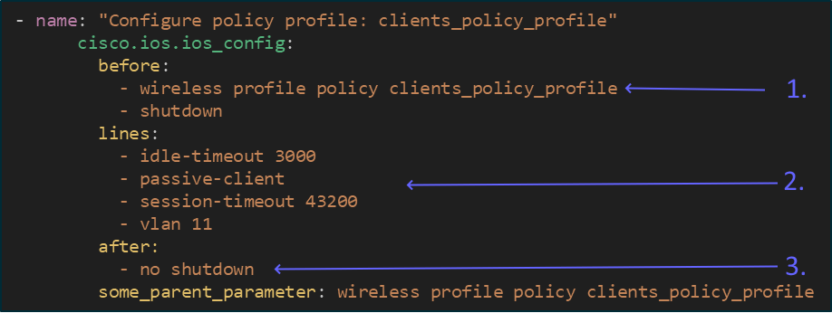

# About Day 2

### Work in progress

The Day 2 content is still work in progress to convert from the old format (Powerpoint) to GitBook format. The main advantage of GitBook for the students is that copy-paste works much better. The main advantages for myself is easier styling of code boxes, and that it is easier to keep up to date.

Until this section is finished, you can look in the [note-pdf-and-pptx-variants.md](../prequel/notes/note-pdf-and-pptx-variants.md "mention") chapter of the Prequel>Notes section and download the Day 2 PPTX from WLPC Phoenix'25.

### Complete previous relevant exercises

Day 2 content contains in-depth exploration of one or more topics of your choice. You should have completed relevant parts of the pre-lab tasks and Day 1 exercises, meaning

* Day 2 Grafana exercises will build on Day 1 Grafana content
* Day 2 Ansible exercises will build on Day 1 Ansible content
* Day 2 Python exercises will build on Day 1 Python content

### Exercise structure

For each exercise, we will try to keep the following structure

1. Tasks
   1. One or more tasks
   2. Expected output
2. Hints
   1. One or more hints to get you in the right direction
   2. Can be explanations/walkthroughs and/or code snippets
3.  Example solution

    1. An example solution (note that most exercises will have many possible solutions, and many of them will be better than the example)
    2. Example output from successful run
    3. Example solutions for most tasks is included in the "solutions" folder of the git repository you cloned in the pre-lab tasks

    <figure><figcaption></figcaption></figure>

### Error handling

Examples in this lab will have minimal error handling. This is by design, to keep the examples as small and readable as possible.
