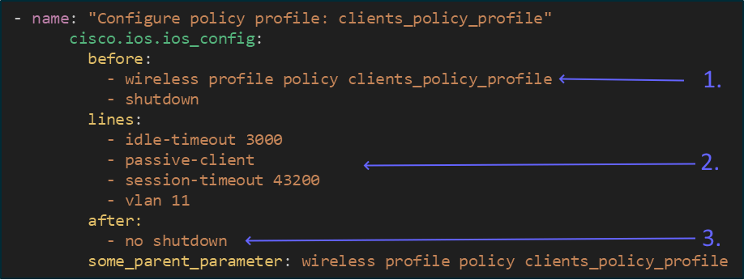

# Tasks

### Task 0: Set up the files and folders and VS Code

* Create a working directory <kbd>ansible-run-cli-commands</kbd>
* Create a playbook file <kbd>run-cli-command-playbook.yml</kbd>

<div align="center"><figure><figcaption></figcaption></figure></div>

* Remember to activate the automation-venv, it should show in the lower right corner of VS Code, and it should show at the beginning of the line in the terminal

<div align="center"><figure><figcaption></figcaption></figure></div>

<div align="center"><figure><figcaption></figcaption></figure></div>


### Task 1: Write a playbook that

* Runs the command "show wireless summary | inc Max APs"
* Output when running this on the WLC should be like this

<div align="center"><figure><figcaption></figcaption></figure></div>


### Task 2: Run the playbook on your WLC

* You can copy the inventory file hosts.yml from Day 1
* Change <kbd>{WLC-IP}</kbd> with your WLC IP (192.168.10.51, 52, 53, 54, 55, 56, etc)


```yaml
wlc:
  hosts:
    192.168.10.{WLC-IP}:
  vars:
    ansible_connection: network_cli
    ansible_network_os: ios
    ansible_ssh_pass: restconf-pass
    ansible_password: restconf-pass
    ansible_user: restconf-adm
    ansible_host_key_checking: False

```

