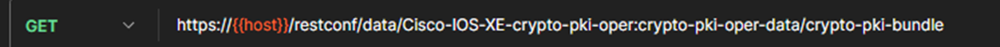

# 204. RESTCONF

We can do RESTCONF calls directly from Ansible instead of running CLI commands (using SSH)

* Some pros with RESTCONF instead of CLI plugins from Ansible
  * The return can be JSON, which is easy to use like a dictionary
  * The speed of getting back data is high, especially if you compare to larger amount of CLI data. For instance, getting a table of connected clients when you have a lot of them
* Some cons with RESTCONF instead of CLI plugins from Ansible
  * There must exist a YANG model for what you are looking for
  * You must find the correct xpath of the YANG model

In this exercise, we will get the certificates on the WLC, and more specifically the validity dates associated with the certs

We will use the YANG module "Cisco-IOS-XE-crypto-pki-oper" to get operational data about the certificates

<figure><figcaption></figcaption></figure>
